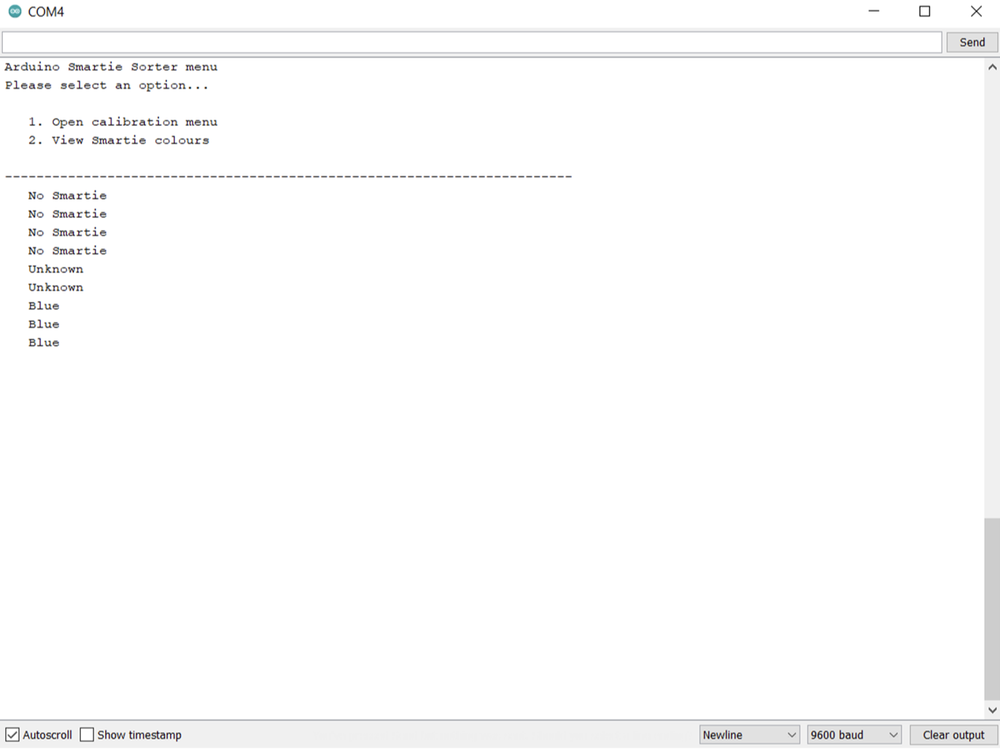

# Smartie Sorter 3000

   

Smartie Sorter 3000 project for sorting Smarties and M&M's based on their colour using the TCS3200 colour sensor built into a mini arcade game enclosure.

The project was written using C++ and runs on an Arduino Nano microcontroller. The mini arcade game enclosure was designed using Fusion 360. The physical components were either laser-cut out of MDF and acrylic, or 3D printed using a Bambu Lab X1 Series 3D printer.

## Arduino Sketches

The [smartie_sorter](https://github.com/pieterberg/Smartie-Sorter/tree/main/smartie_sorter) folder contains the code to determine the Smartie and M&M colours using the TCS3200 colour sensor module. The [enclosure_code](https://github.com/pieterberg/Smartie-Sorter/tree/main/enclosure_code) folder contains the code to control the Smartie Sorter 3000's mini arcade game enclosure.

## Documentation

- [Components.md](documentation/components.md) provides information about the components used in the design of the Smartie Sorter 3000's mini arcade game enclosure. First, it provides information about the different types of components used in the design of the Smartie Sorter 3000's mini arcade game enclosure. Thereafter, it provides information about laser cutting the wooden panels and acrylic components. Finally, it provides information about the Fusion 360 computer aided design (CAD) files.

- [Design.md](documentation/design.md) provides information about the design of the Smartie Sorter 3000. First, it provides information about the name sign present at the top of the Smartie Sorter 3000's mini arcade game enclosure. Thereafter, it provides information about the Smartie Sorter 3000's colour scheme. Finally, it provides information about the sorted Smartie and M&M locations.

## Fusion 360

The [fusion_360](https://github.com/pieterberg/Smartie-Sorter/tree/main/fusion_360) folder contains the .f3d and .f3z Fusion 360 component and assembly files for the Smartie Sorter 3000's mini arcade game enclosure.

