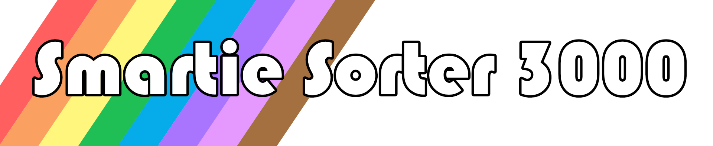
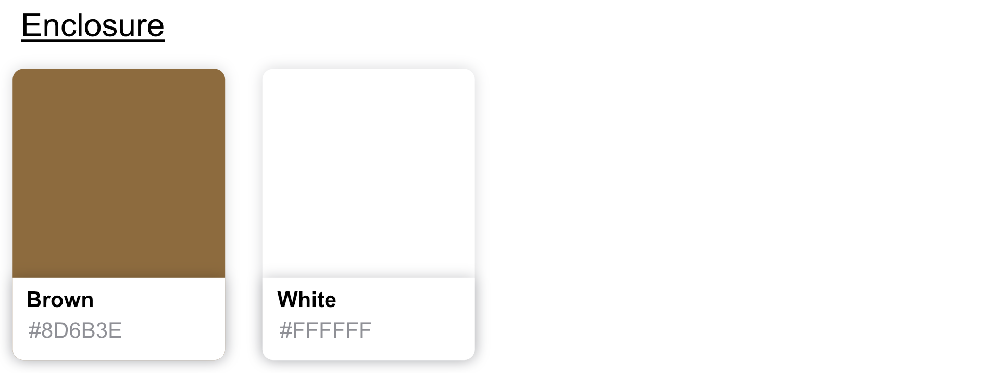
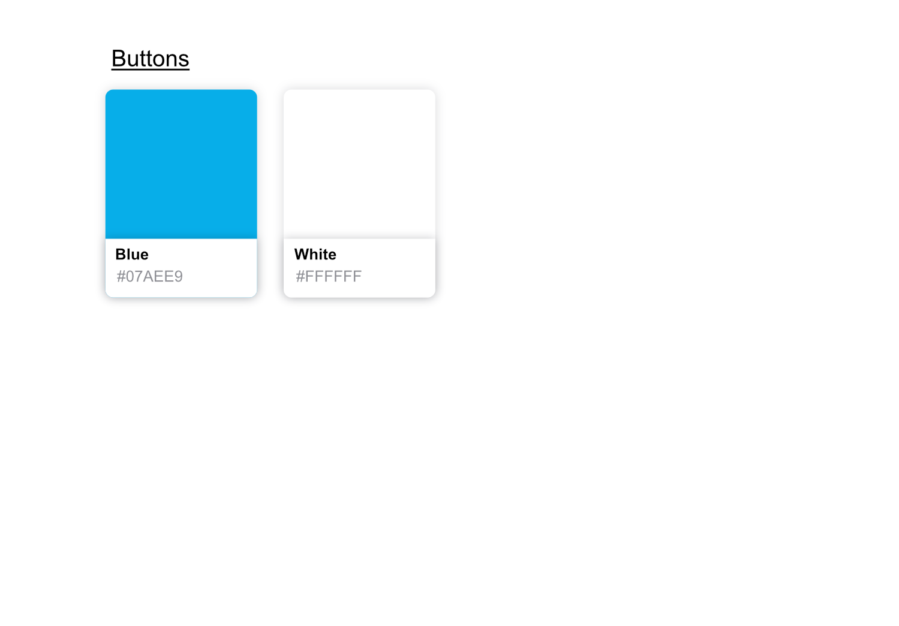
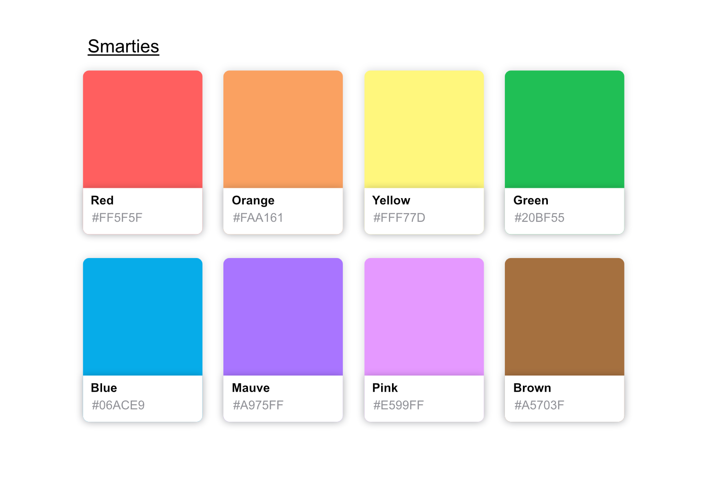
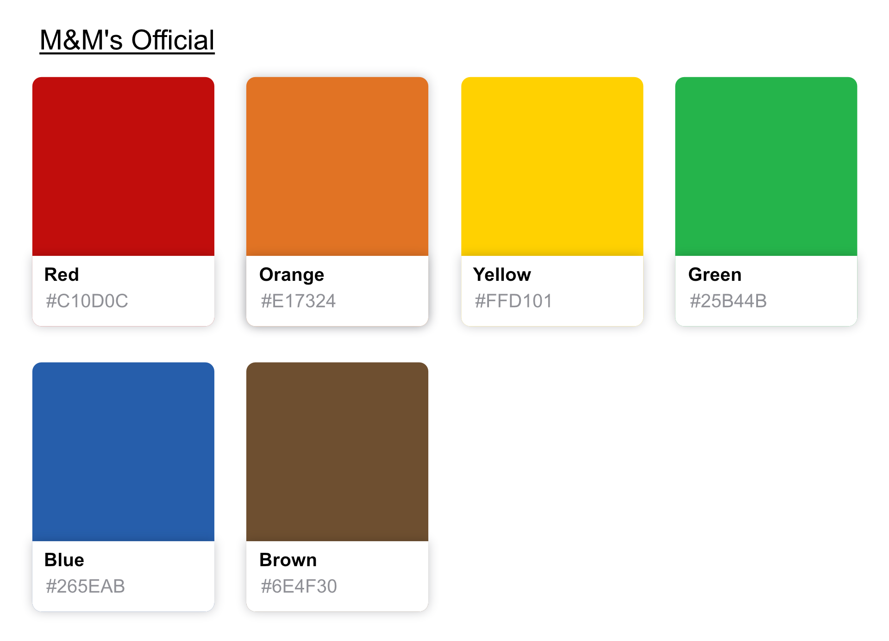

# Design

## 1. Name sign

Figure 1: Smartie Sorter 3000 name sign used at the top of the mini arcade game enclosure

## 2. Colour scheme

### 2.1 Enclosure design

Figure 2: Colours used in the construction of the mini arcade game enclosure

Figure 3: Colours used for the arcade buttons

### 2.2 Smartie colours

Figure 4: Colours used to represent the eight different Smartie colours

Table : Hex codes used to represent the Smartie colours

| Smartie Colours |  Hex code |
|-----------------|:---------:|
| Red             | `#FF5F5F` |
| Orange          | `#FAA161` |
| Yellow          | `#FFF77D` |
| Green           | `#20BF55` |
| Blue            | `#06ACE9` |
| Mauve           | `#A975FF` |
| Pink            | `#E599FF` |
| Brown           | `#A5703F` |

### 2.3 M&M colours

Figure 5: Colours used to represent the six M&M colours using the Smarties colour scheme

Figure 6: Colours used to represent the six M&M colours using the official M&M colour scheme