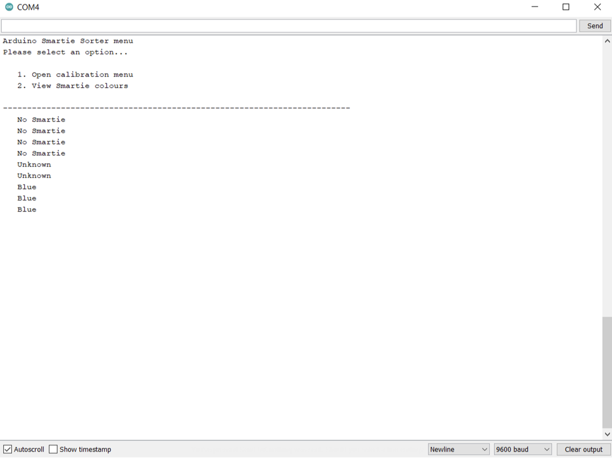
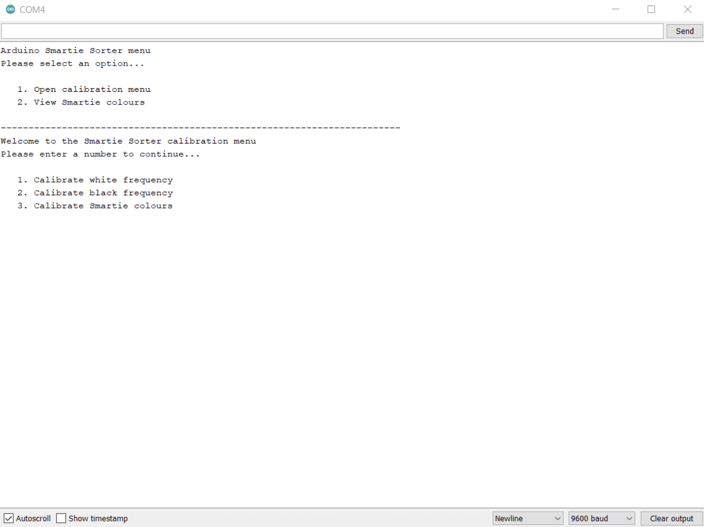
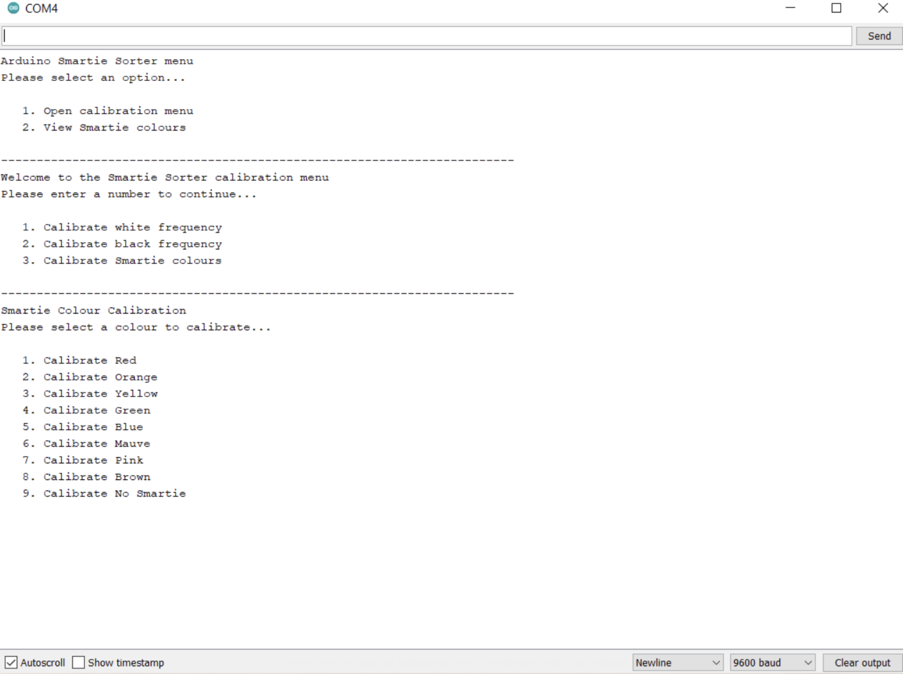

# Smartie Sorter 3000

 

## About

Arduino Smartie Sorter projects using an Arduino Nano board

Based on the [Arduino Skittles Sorter](https://howtomechatronics.com/projects/arduino-color-sorter-project/) from How To Mechatronics

## Images

